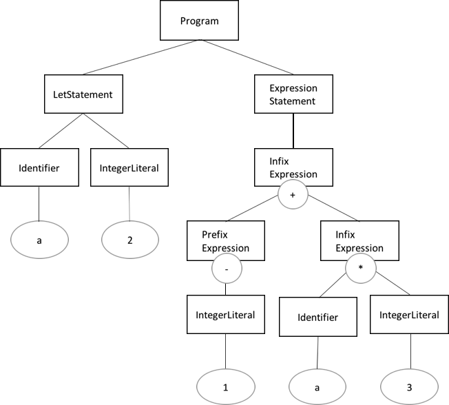

# 评价 (评价;) 

## AST示例

以下MiniMonkey程序的AST的字符串表示和图像图. AST的字符串表示

    let a = 2;
    -1 + a * 3;

-   AST的形象

        let a = 2;
        ((-1) + (a * 3));

-   评估者评估这样的AST并获得结果 (评估值) . 

      

评估方法树行走翻译

## 遵循AST并顺序执行每个节点的含义

-   简单

    -   慢
    -   占地面积小
    -   虚拟机
    -   将AST转换为虚拟机的字节码并按顺序执行字节码

-   复杂性

    -   快
    -   高便携性
    -   我们将JIT (Just In Time) 解释器/编译器称为将字节代码转换为机器语言而不是顺序执行的方法. 
    -   它甚至更快. 
    -   树行走翻译

## 这次是我实施的树行走翻译. 

实现解释器需要以下三点. 

跟随AST

-   评估表达式
-   在解释器的宿主语言中表达评估值 (数据转换) 
-   数据转换

### MiniMonkey评估结果 (评估值) 

object.Object接口[它由满足的结构表示. ](src/03/src/minimonkey/object/object.go)以下3种类型定义为MiniMonkey评估值的数据类型. 

    # object/object.go
    package object

    type ObjectType string

    type Object interface {
        Type() ObjectType
        Inspect() string
    }

这些满足object.Object接口. 

-   object.Integer
-   object.Null
-   object.Error

### 环境

环境是用于将值绑定到符号 (标识符) 的容器. 符号的评估值由当时的环境确定. 以下代码显示当前环境中的符号

在值`var`我受约束. `5`实现是一个哈希映射 (关联数组) ,其符号是键,值是值. 在MiniMonkey

    let var = 5;

包装哈希映射的结构[我会表达这个. ](src/03/src/minimonkey/object/environment.go)我们做吧

    # object/environment.go
    package object 

    type Environment struct {
        store map[string]Object
    }

    func (e *Environment) Get(name string) (Object, bool) {
        val, ok := e.store[name]
        return val, ok
    }

    func (e *Environment) Set(name string, val Object) Object {
        e.store[name] = val
        return val
    }

## 提供的来源

[所以我们中途安装了评估员并准备了一个测试. ](src/03/src/minimonkey)evalutor.go

[让我们通过编辑来创建评估以下AST节点的点. ](src/03/src/minimonkey/evalutor/evalutor.go)ast.Program

1.  ast.ExpressionStatement
2.  ast.IntegerLiteral
3.  ast.PrefixExpression
4.  ast.InfixExpression
5.  ast.LetStatement
6.  ast.Identifier
7.  使用以下命令执行测试. 

让我们实施,以便'失败'消失. 

    $ cd src/03
    $ GOPATH=$(pwd) go test ./src/minimonkey/...

在上一轮中,我们计划实施功能. 

### 实施例

evalutor.go. 的[实施例](src/03/src/minimonkey/evalutor/_evalutor.go)
